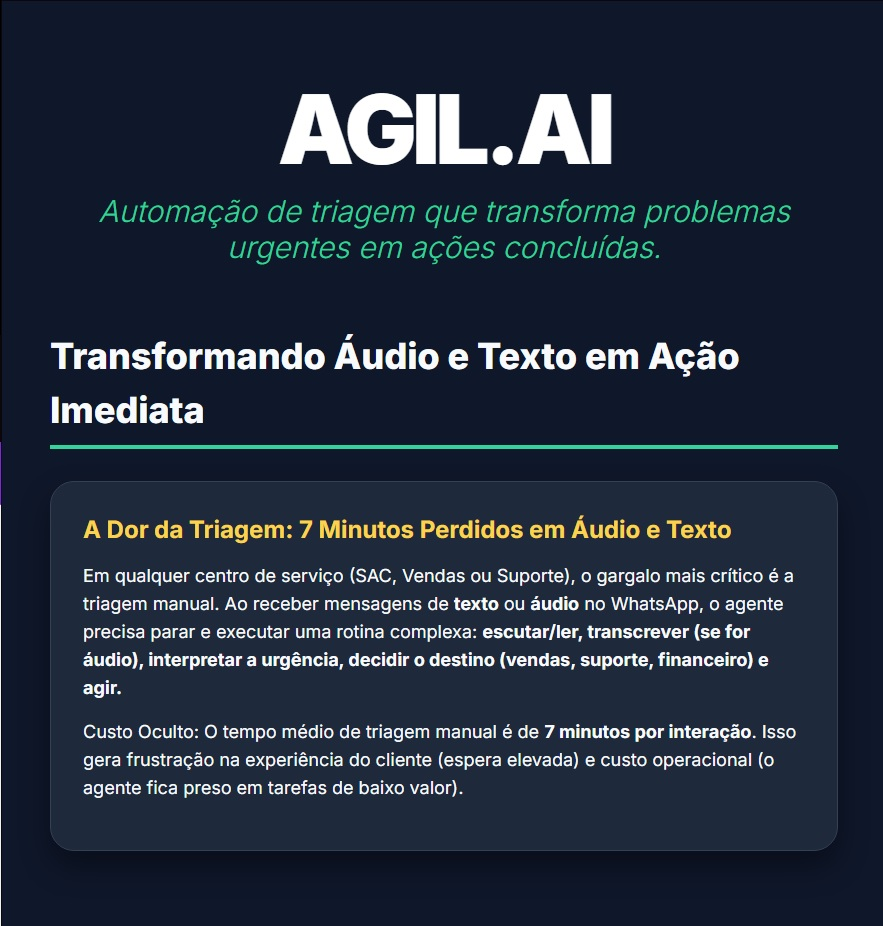
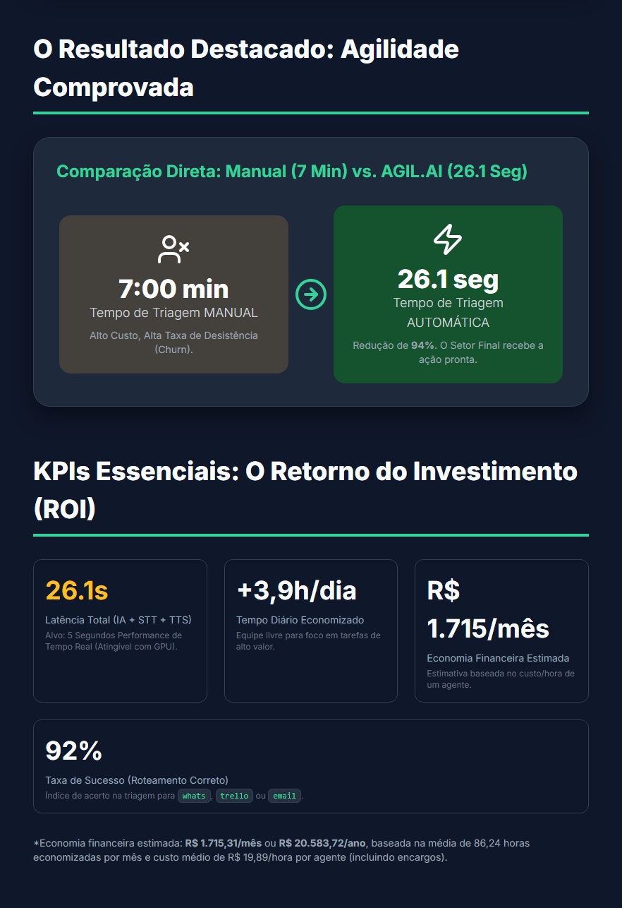
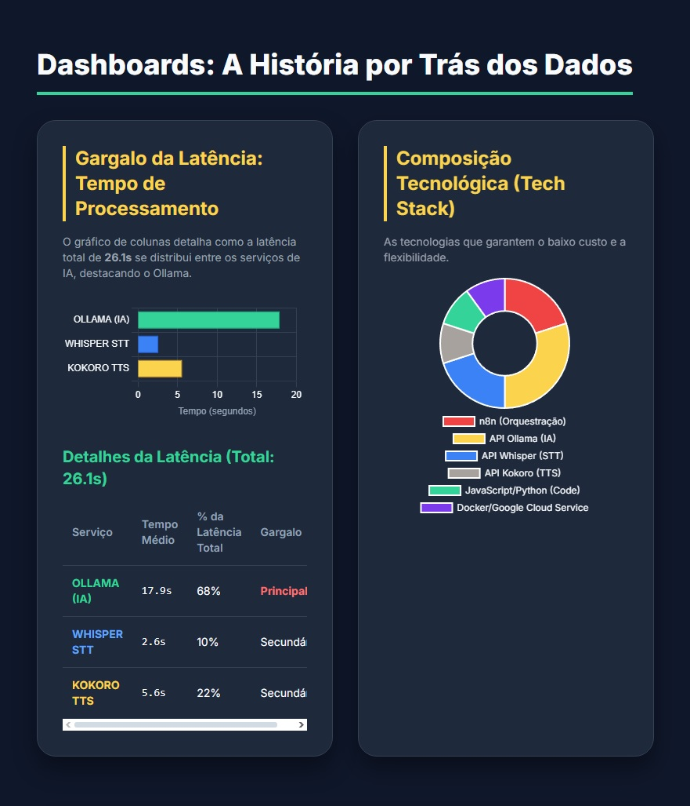
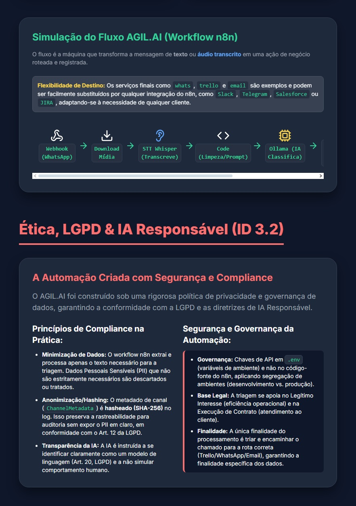
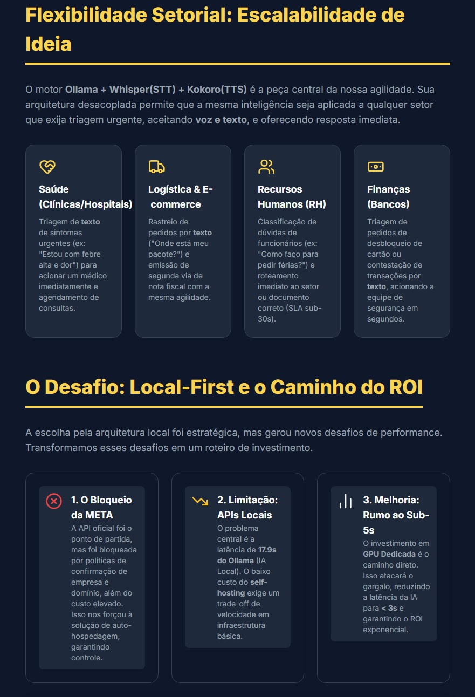
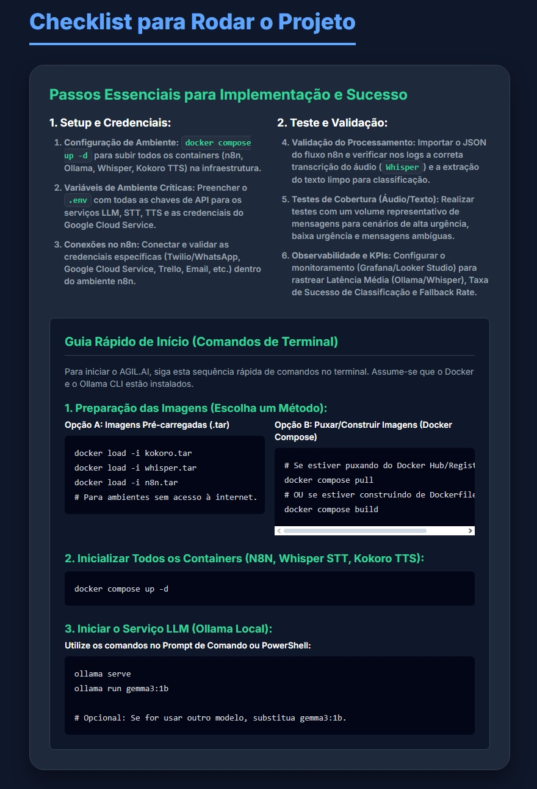
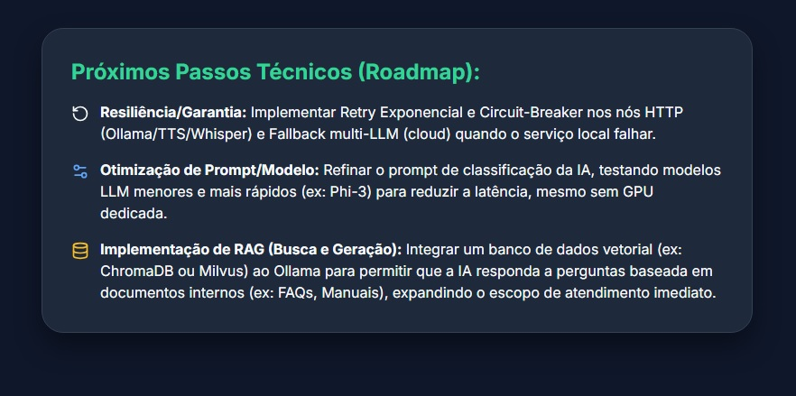
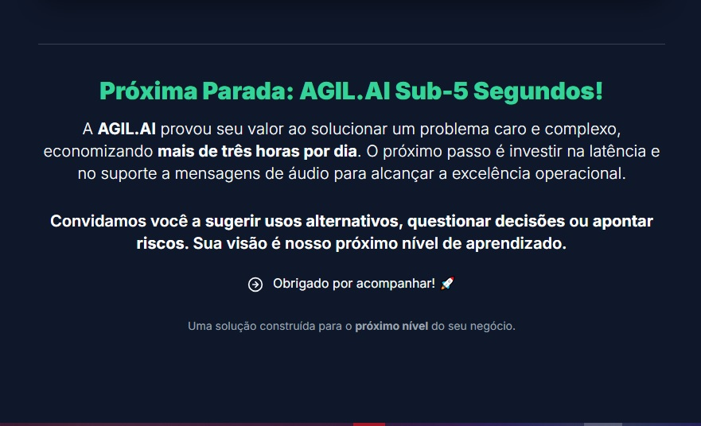

<div align="center">

<a href="https://www.youtube.com/watch?v=K8CMWyNNGLc" target="_blank" rel="noopener noreferrer">
  
</a>

<br/>

<sub>Clique no GIF para assistir à demonstração completa no <a href="https://www.youtube.com/watch?v=K8CMWyNNGLc">YouTube</a></sub>

<br/><br/>

# AGIL.AI

### Automação de triagem que transforma problemas urgentes em ações concluídas

[](docker-compose.yml)
[](https://n8n.io)
[](https://ollama.com)
[](https://www.python.org)

**Transformando áudio e texto em ação imediata** — roteamento inteligente via WhatsApp para e-mail, Trello e alertas operacionais.

[Visão geral](#-visão-geral) ·
[Resultados](#-resultados-e-kpis) ·
[Arquitetura](#-arquitetura) ·
[Fluxo n8n](#-fluxo-de-automação-n8n) ·
[Compliance](#-ética-lgpd-e-ia-responsável) ·
[Instalação](#-instalação-rápida) ·
[Roadmap](#-roadmap)

</div>

---


## Visão geral

<p align="center">
  
</p>

<p align="center"><em>Slide 1 — A dor da triagem: 7 minutos perdidos por interação em áudio e texto.</em></p>

Em centros de serviço (SAC, Vendas ou Suporte), o gargalo mais crítico é a **triagem manual**. Ao receber mensagens de texto ou áudio no WhatsApp, o agente precisa escutar/ler, transcrever, interpretar urgência, decidir o destino e agir — em média **7 minutos por interação**.

O **AGIL.AI** automatiza esse ciclo com IA local, orquestração no **n8n** e integrações prontas para produção.

| Entrada | Processamento | Saída |
|:--------|:--------------|:------|
| Texto ou áudio (WhatsApp) | STT → Classificação (LLM) → Roteamento | WhatsApp · E-mail · Trello · Logs |

---

## Resultados e KPIs

<p align="center">
  
</p>

<p align="center"><em>Slide 2 — Agilidade comprovada e retorno do investimento.</em></p>

| Indicador | Manual | AGIL.AI | Ganho |
|:----------|:-------|:--------|:------|
| Tempo de triagem | 7 min | **26,1 s** | **−94%** |
| Latência total (IA + STT + TTS) | — | 26,1 s | Meta sub-5 s com GPU |
| Tempo economizado | — | **+3,9 h/dia** | Equipe focada em alto valor |
| Economia estimada | — | **R$ 1.715/mês** | Por agente* |
| Taxa de roteamento correto | — | **92%** | WhatsApp · Trello · E-mail |

<sub>* Estimativa baseada em ~86 h economizadas/mês e custo médio de R$ 19,89/h por agente (encargos inclusos). Valor anual projetado: ~R$ 20.583.</sub>

---

## Dashboards e métricas

<p align="center">
  
</p>

<p align="center"><em>Slide 3 — A história por trás dos dados.</em></p>

**Distribuição da latência (26,1 s total)**

| Serviço | Tempo | Participação | Papel |
|:--------|------:|:-------------|:------|
| Ollama (IA) | 17,9 s | 68% | Principal gargalo |
| Kokoro (TTS) | 5,6 s | 22% | Secundário |
| Whisper (STT) | 2,6 s | 10% | Secundário |

**Stack tecnológica:** n8n · Ollama · Whisper · Kokoro · JavaScript/Python · Docker · Google Cloud

---

## Arquitetura

<p align="center">
  
</p>

<p align="center"><em>Slide 4 — Pipeline de automação e governança de dados.</em></p>

```
WhatsApp (Webhook) → Download mídia → Whisper (STT) → Code (limpeza/prompt)
      → Ollama (classificação) → Switch → WhatsApp | Gmail | Trello | Logs
```

**Flexibilidade de destino:** o fluxo atual usa WhatsApp, Trello e e-mail, mas pode ser adaptado para Slack, Telegram, Salesforce, JIRA e outras integrações nativas do n8n.

### Microsserviços deste repositório

| Serviço | Porta | Função |
|:--------|------:|:-------|
| **n8n** | 5678 | Orquestração do workflow |
| **Kokoro** | 8000 | Text-to-Speech (TTS) |
| **Whisper** | 9000 | Speech-to-Text (STT) |
| **Ollama** | 11434 | LLM local no host (`gemma3:1b`) |

---

## Fluxo de automação (n8n)

<p align="center">
  
</p>

<p align="center"><em>Diagrama real do workflow — triagem, latência, alertas e logs.</em></p>

O fluxo está organizado em três camadas:

- **Latência** — medição de tempos (Ollama, TTS, etapas críticas)
- **Lógica principal** — webhook, STT, classificação IA, roteamento e resposta em áudio
- **Alertas e logs** — falhas encaminhadas por e-mail e registradas no Google Sheets

### Registro operacional (Google Sheets)

<p align="center">
  
</p>

<p align="center"><em>Exemplo de planilha de monitoramento — roteamento, alertas de API e latência por interação.</em></p>

---

## Escalabilidade e desafio Local-First

<p align="center">
  
</p>

<p align="center"><em>Slide 5 — Motor desacoplado aplicável a múltiplos setores.</em></p>

| Setor | Caso de uso |
|:------|:------------|
| **Saúde** | Triagem de sintomas urgentes e encaminhamento |
| **Logística / E-commerce** | Rastreamento e segunda via de documentos |
| **RH** | Classificação de dúvidas com SLA &lt; 30 s |
| **Finanças** | Desbloqueio de cartão e contestações |

**Arquitetura Local-First:** controle total dos dados e custo reduzido. O gargalo atual é a latência do Ollama em CPU (~17,9 s); a evolução prevista é **GPU dedicada** para atingir **sub-5 s**.

---

## Ética, LGPD e IA responsável

O AGIL.AI foi construído com política rigorosa de privacidade e governança:

| Princípio | Implementação |
|:----------|:--------------|
| **Minimização de dados** | Extração apenas do texto necessário para triagem |
| **Anonimização** | Metadados hasheados (SHA-256) nos logs |
| **Transparência da IA** | Modelo identificado como IA, sem simular humano |
| **Governança de segredos** | Variáveis em `.env`; credenciais OAuth no n8n criptografadas |
| **Base legal** | Interesse legítimo e execução de contrato |
| **Finalidade** | Triagem e encaminhamento ao canal correto |

---

## Instalação rápida

<p align="center">
  
</p>

<p align="center"><em>Slide 7 — Passos essenciais de implementação.</em></p>

### Pré-requisitos

- [Docker](https://www.docker.com/) e Docker Compose
- [Ollama](https://ollama.com/) instalado no host
- Contas: Twilio (WhatsApp), Google Cloud, Trello, Gmail

### 1. Configurar ambiente

```powershell
copy .env.example .env
# Edite o .env com seus valores reais
```

### 2. Modelos Kokoro (build local)

Coloque na raiz do projeto antes do build:

- `kokoro-v1.0.onnx`
- `voices-v1.0.bin`

### 3. Subir a stack

```powershell
# Opção A — imagens .tar offline (se disponíveis)
docker load -i kokoro.tar
docker load -i whisper.tar

# Opção B — build online
docker compose build

docker compose up -d
```

### 4. Iniciar Ollama (host)

```powershell
ollama serve
ollama run gemma3:1b
```

### 5. Configurar n8n

1. Acesse `http://localhost:5678`
2. Importe `n8n-ia-workflow.example.json`
3. Conecte credenciais: Twilio, Gmail, Google Sheets, GCS, Trello
4. Gere novo path de webhook e atualize no Twilio

### Verificação antes do push (desenvolvedores)

```powershell
.\scripts\verificar-antes-do-push.ps1
```

---

## Roadmap

<p align="center">
  
</p>

<p align="center"><em>Slide 6 — Evolução técnica planejada.</em></p>

| Fase | Objetivo |
|:-----|:---------|
| **Resiliência** | Retry exponencial, circuit-breaker e fallback multi-LLM (cloud) |
| **Otimização** | Refinar prompts; testar modelos menores (ex.: Phi-3) |
| **RAG** | Banco vetorial (ChromaDB/Milvus) para FAQs e manuais internos |
| **Performance** | GPU dedicada → latência IA **&lt; 3 s** e fluxo **sub-5 s** |

<p align="center">
  
</p>

<p align="center"><em>Slide 8 — Visão de futuro: excelência operacional com áudio e baixa latência.</em></p>

---

## Estrutura do repositório

```
AGIL.AI/
├── assets/                    # Imagens do pitch deck
├── docker-compose.yml         # Orquestração n8n + Kokoro + Whisper
├── kokoro_api.py              # API TTS
├── whisper_api.py             # API STT
├── n8n-ia-workflow.example.json
├── .env.example
└── scripts/
    └── verificar-antes-do-push.ps1
```

---

## Documentação complementar

| Arquivo | Descrição |
|:--------|:----------|
| [.env.example](.env.example) | Template de variáveis de ambiente |
| [n8n-ia-workflow.example.json](n8n-ia-workflow.example.json) | Workflow sanitizado para importação |

---

<div align="center">

### Próxima parada: AGIL.AI sub-5 segundos

Uma solução construída para o **próximo nível** do seu negócio.

**Desenvolvido por Leonardo Campos** · PUC — Tecnologia em Inteligência Artificial e Sistemas de Dados Inteligentes

</div>
